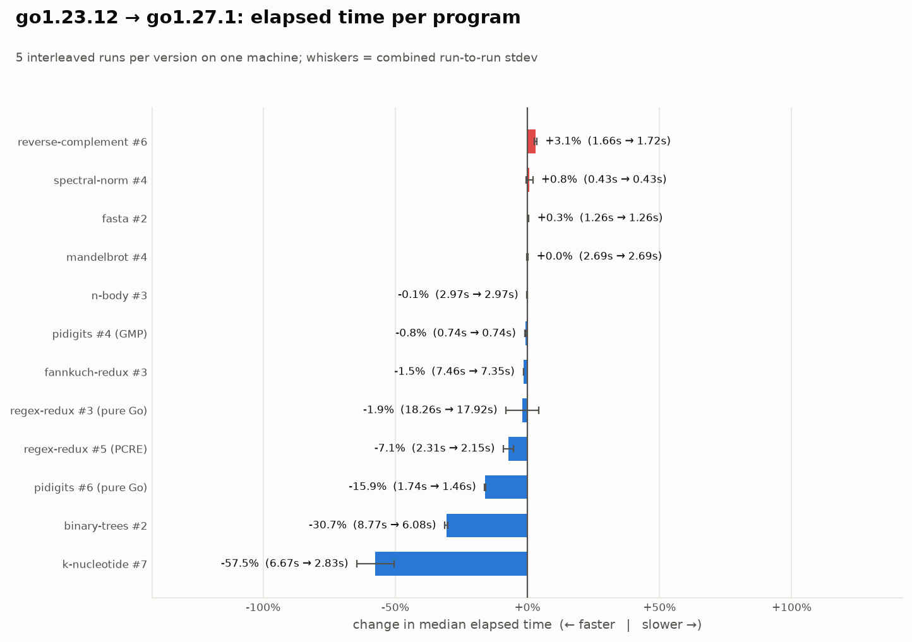
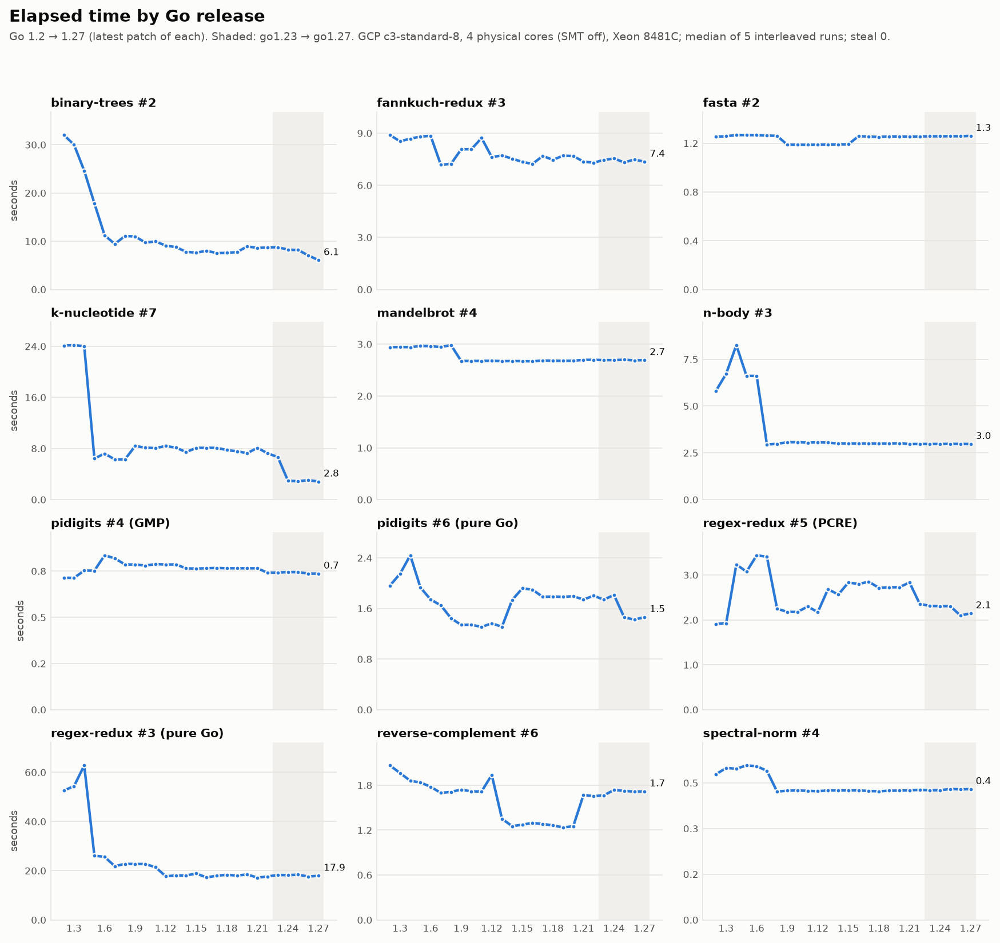
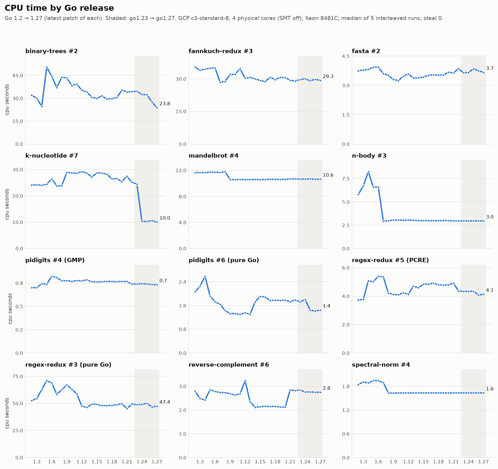
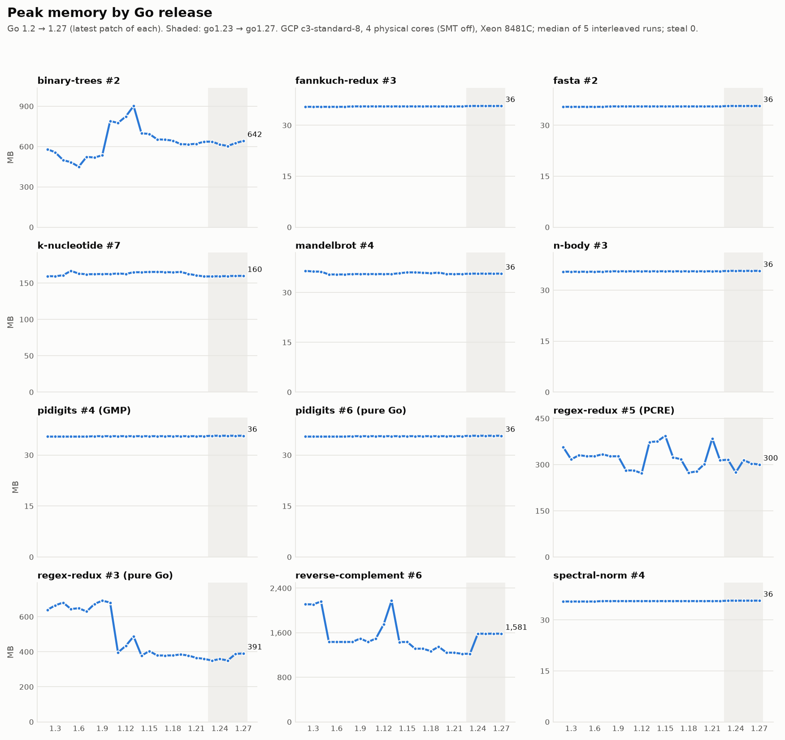
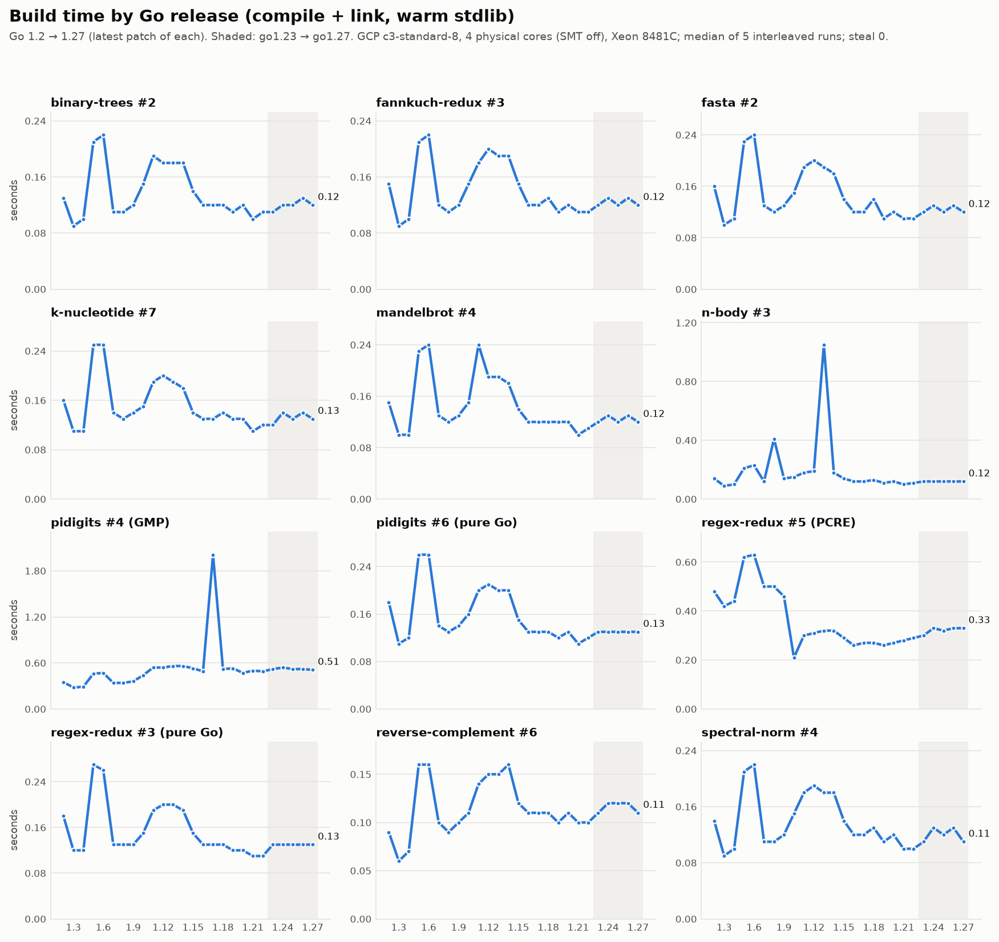

# go-bench — Benchmarks Game Go programs, re-run across Go releases

Goal: take the fastest Go programs from the
[Benchmarks Game Go page](https://benchmarksgame-team.pages.debian.net/benchmarksgame/fastest/go.html)
and re-measure them for the latest patch of every Go minor release, newest first
(go1.27.1, go1.26.8, go1.25.14, …), on one machine, with one harness, so the numbers
compare cleanly across releases.

> **Summary** (GCP, 4 dedicated cores, 5 interleaved runs, 0 steal): go1.27.1 is 11.5% faster than go1.23.12 and about 41% faster
> than go1.2.2 (geomean elapsed across 12 programs).

## Final results (GCP, 2026-09-25)

GCP `c3-standard-8 --threads-per-core=1`: 4 physical cores (Xeon Platinum 8481C), 32 GB RAM, Ubuntu 24.04.
26 releases (go1.2.2 → go1.27.1) × 12 programs, 5 interleaved runs each, `--drop-caches`, `GOAMD64=v2`.
1,560 timed runs over 3 h with **0 s hypervisor steal**; median run-to-run variation 0.29%. Every program produced
byte-identical full-size output on every release. Raw data: `results/final/gcp-c3-4c-all-versions.json`.
Report and charts: [`results/final/summary.md`](results/final/summary.md).

**go1.23.12 → go1.27.1: 11.5% faster** (geomean elapsed), 12.3% less CPU, modelled energy −11.5%.

| program | 1.23 → 1.27 elapsed | where |
|---|---:|---|
| k-nucleotide | **−57.5%** | step at go1.24 |
| binary-trees | **−30.7%** | −14% at go1.27 |
| pidigits (pure Go) | **−15.9%** | step at go1.25 |
| regex-redux (PCRE) | −7.1% | step at go1.26 |
| regex-redux (pure Go), fannkuch-redux | −2% | |
| n-body, mandelbrot, fasta, spectral-norm, pidigits (GMP) | ±1% | |
| reverse-complement | +3.1% | peak memory +29% |

**Whole history** (geomean elapsed relative to go1.27.1; 1.00 = as fast as 1.27):

| go1.2 | 1.4 | 1.5 | 1.6 | 1.7 | 1.8 | 1.10 | 1.13 | 1.16 | 1.20 | 1.23 | 1.24 | 1.25 | 1.26 | 1.27 |
|---:|---:|---:|---:|---:|---:|---:|---:|---:|---:|---:|---:|---:|---:|---:|
| 1.69 | 1.83 | 1.42 | 1.39 | 1.21 | 1.16 | 1.16 | 1.12 | 1.14 | 1.14 | 1.13 | 1.06 | 1.04 | 1.01 | 1.00 |

Build time (compile + link, warm stdlib) is about 0.15 s per program across releases, with a bump at go1.5–1.6.



### Every release, go1.2 → go1.27

One panel per program; the shaded band is go1.23 → go1.27. Each point is the median of 5 interleaved runs on the GCP machine.

**Elapsed time** (wall clock).



**CPU time** (user + sys summed over all threads).



**Peak memory** (max RSS).



**Build time** (rebuild of the program only, compile + link, warm stdlib).



## Layout

| path | what |
|---|---|
| `bin/govm` | a small Go version manager. It downloads toolchains from the Go module proxy (`golang.org/toolchain`), the same source `GOTOOLCHAIN` uses, and verifies them against `sum.golang.org`. Every release back to go1.2.2 is there. |
| `programs/` | the chosen Benchmarks Game programs, copied verbatim from the official source zip (BSD-3, see `programs/LICENSE`), plus `*.compat.go` backports |
| `benchmarks.json` | which program represents each task, with its workload, reference check and the site's own time |
| `testdata/` | official reference inputs and outputs, used to check every build |
| `bench.py` | build → check → checksum → timed runs, interleaved across versions; writes JSON and a Markdown table |
| `scripts/setup-ubuntu.sh` | prepares Ubuntu 24.04–26.04 (GMP, PCRE; builds PCRE 8.45 from source on 26.04). `--tune` pins the CPU. |
| `scripts/compat.py` | build + reference check of every program on every release (currently 312/312 ok) |
| `scripts/plots.py` | charts in `results/plots/` and `results/summary.md` |
| `results/` | raw JSON per run set, `summary.md`, `plots/` |

## The programs

For each task, the program is the **fastest Go program by elapsed seconds** on the site (the site measured go1.23.1 with `GOAMD64=v2` on a quad-core machine).
For pidigits and regex-redux the winner calls C (GMP or PCRE), so the fastest **pure-Go** program is tracked too. That's the row that actually measures the Go compiler, runtime and stdlib.

| task | program | variant | notes |
|---|---|---|---|
| binary-trees | Go #2 | fastest | GC / allocation heavy |
| fannkuch-redux | Go #3 | fastest | |
| fasta | Go #2 | fastest | |
| k-nucleotide | Go #7 | fastest | built-in `map` |
| mandelbrot | Go #4 | fastest | |
| n-body | Go #3 | fastest | float64 |
| spectral-norm | Go #4 | fastest | |
| reverse-complement | Go #6 | fastest | input is ~1 GB (fasta n=100M) |
| pidigits | Go #4 | fastest | cgo → libgmp |
| pidigits | Go #6 | pure-go | `math/big` |
| regex-redux | Go #5 | fastest | cgo → libpcre (JIT), `github.com/GRbit/go-pcre v1.0.0` |
| regex-redux | Go #3 | pure-go | `regexp` |

Source: the site's own repository, via a mirror
([gitlab.com/hugefiver/benchmarksgame](https://gitlab.com/hugefiver/benchmarksgame) → `public/download/benchmarksgame-sourcecode.zip`,
measurements in `public/data/data.csv`).

## Same source on every release

Five programs used APIs newer than go1.2 or go1.12. Each has a minimal `.compat.go` backport, and **every Go version runs the backport**:
signed shift count → `uint(...)`, `sort.Slice` → `sort.Sort`, `strings.Builder` → `bytes.Buffer`,
`for range x` → `for _ = range x`, `bufio.Reader.Discard` → `ReadSlice('\n')`. On go1.27.1 the backports match the
originals within noise and produce byte-identical full-size output (`results/backport-ab-go1.27.1.json`).

## Method

* Toolchains: `bin/govm install go1.X.Y` (proxy.golang.org, sumdb-verified). Builds run with `GOTOOLCHAIN=local`.
  go1.2–go1.10 build in GOPATH mode; cgo before go1.8 links with `-no-pie`.
* Each program builds as its own module. The `go` directive equals the toolchain's minor version, so every release compiles with its own language semantics (for example, per-iteration loop variables from 1.22 on).
* `GOAMD64=v2`, same as the site. (v3 would let newer compilers fuse FMA and change n-body/spectral-norm results.)
* Every build is checked byte-for-byte against the official small-workload output. The full-size output is SHA-256'd so any drift between Go versions shows up.
* Timed runs: stdout goes to `/dev/null`. **secs** = wall clock to finish; **cpu secs** = user+sys summed over all threads (`wait4` rusage), the same two columns as the site; memory is peak RSS; `steal` = hypervisor steal time during the run (should be ~0).
* Build secs = rebuild of the program only (compile + link) after the stdlib is warm, so it compares across releases. Rounds interleave versions × programs, so slow periods on the machine hit every version equally. Median and min are both reported.
* Inputs for k-nucleotide (fasta 25M), regex-redux (fasta 5M) and reverse-complement (fasta 100M) are generated once with fasta Go #1.

## Usage

```sh
git clone https://github.com/nrnjn42/go-bench && cd go-bench
sudo scripts/setup-ubuntu.sh --tune
bin/govm list-remote                    # latest patch of every go1.N
scripts/compat.py                       # optional: build/check matrix for every release

# final measurement: every release, 5 interleaved runs, page cache dropped per round (root)
sudo -E ./bench.py run $(bin/govm list-remote | sed 's/^/--go /') --runs 5 --drop-caches --label <machine>

python3 scripts/plots.py --sweep results/<file>.json --timed results/<file>.json
```

Runtime: one round of all 12 programs over all 26 releases is ~45 min, so `--runs 5` is ~4.5 h
(one extra untimed full-size run per program verifies output). Recommended box: 4 dedicated physical cores,
≥16 GB RAM, e.g. GCP `c3-standard-8 --threads-per-core=1`.

## Reproduce on Google Cloud (step by step)

Anyone with a GCP project can re-run the whole study. It takes about 5 hours and costs about $2 (c3-standard-8 is about $0.40/h on demand in us-central1; check current pricing).

**1. Create the VM** (from your laptop, [gcloud CLI](https://cloud.google.com/sdk/docs/install) logged in, billing enabled):

```sh
gcloud config set project <your-project>
gcloud compute instances create go-bench \
  --zone=us-central1-a \
  --machine-type=c3-standard-8 --threads-per-core=1 \
  --image-family=ubuntu-2404-lts-amd64 --image-project=ubuntu-os-cloud \
  --boot-disk-size=30GB --boot-disk-type=pd-balanced
```

`--threads-per-core=1` turns off SMT, so Go sees 4 physical cores with no hyperthread sharing, like the Benchmarks Game quad-core box.
Don't use Spot VMs (preemption loses the interleaved run) or shared-core `e2-*` machines (their CPU is time-sliced with other VMs, so timings are unreliable).
Another provider works too if it gives 4 dedicated cores and ≥16 GB RAM.

**2. Set up** (about 3 minutes):

```sh
gcloud compute ssh go-bench --zone=us-central1-a
git clone https://github.com/nrnjn42/go-bench && cd go-bench
sudo scripts/setup-ubuntu.sh --tune
nproc                         # expect 4
scripts/compat.py             # optional, ~10 min: all 12 programs build + pass on all 26 releases
```

**3. Run** (inside tmux so an SSH drop doesn't kill it):

```sh
tmux new -s bench
sudo -E ./bench.py run $(bin/govm list-remote | sed 's/^/--go /') \
  --runs 5 --drop-caches --label gcp-c3-4c --output results/final-gcp-c3-4c.json
# detach: Ctrl-b d      reattach: tmux attach -t bench
```

The per-run output lines include `steal`; it should stay near 0. Consistently more than about 1% of a run's CPU time means the host is taking CPU away from the VM: use another zone or machine type.

**4. Analyse:**

```sh
python3 scripts/plots.py --sweep results/final-gcp-c3-4c.json --timed results/final-gcp-c3-4c.json
scripts/energy.py results/final-gcp-c3-4c.json --base go1.23.12 --new go1.27.1
```

**5. Get the results and delete the VM:**

```sh
# either push from the VM (needs your git credentials there) ...
git add results && git commit -m "final results: gcp c3-standard-8, 4 cores" && git push
# ... or copy them to your laptop
gcloud compute scp --recurse go-bench:~/go-bench/results ./results-gcp --zone=us-central1-a

gcloud compute instances delete go-bench --zone=us-central1-a    # about $290/month if forgotten
```

## Why the fastest C programs are faster

The gap on the Benchmarks Game is mostly about how the C programs are written, not zeroing or other runtime overhead.
Go zeroes memory when it allocates, not after use, and the CPU-bound programs barely allocate in their hot loops.

* **Hand-written SIMD.** The fastest C program is starred on the site's leaderboard ("possible hand-written vector
  instructions") in 5 of the 10 tasks, and its source uses x86 intrinsics: n-body #9 and spectral-norm #6 use AVX
  (`__m256d`, 4 doubles per instruction), mandelbrot #6 uses SSE2 (`__m128d`), and fannkuch-redux #6 and reverse-complement #7 use
  SSSE3/SSE4.1 byte shuffles (`_mm_shuffle_epi8`). Go's compiler does not auto-vectorize and Go has no stable SIMD API.
* **Against the fastest scalar C program**, from the site's data (go1.23.1), Go is close: n-body 1.28×, spectral-norm 1.00×,
  mandelbrot 0.93×, fannkuch-redux 1.15× (against 3.0×, 3.6×, 2.9× and 3.9× versus the SIMD programs).
* **Libraries and memory management.** The other five fastest C programs are unstarred but call C libraries: khash
  (k-nucleotide), APR memory pools (binary-trees, which frees whole trees at once and never pays for GC), GMP (pidigits) and
  PCRE2 (regex-redux).
* **Build settings.** C is compiled with GCC `-O3 -march=<cpu>`: more aggressive inlining and loop optimization, plus the host's newest
  instructions. Go is built with its default fast-compiling toolchain at `GOAMD64=v2`, and keeps slice bounds checks where it
  cannot prove them unnecessary.

## Energy

`scripts/energy.py` estimates the energy change between two releases without a power meter. It uses the linear model fitted
to the raw RAPL data of van Kempen et al., [*It's Not Easy Being Green*](https://arxiv.org/abs/2410.05460)
(2024; [data](https://github.com/nicovank/energy-languages); their Go was 1.23.1):

    energy ≈ 1.99 J × cpu-seconds + 286.6 J × elapsed-seconds     (R² = 0.97 over 3,192 runs, 13 languages)

On their dual-socket server the elapsed-time term dominates. CPU time alone does not predict energy there (R² ≈ 0), so the script reports
cpu, elapsed and modelled energy side by side. The constants depend on the machine; `scripts/energy.py --refit <repo>` recomputes them.

On the GCP data (`scripts/energy.py results/final/gcp-c3-4c-all-versions.json --base <old> --new go1.27.1`), geomean change to go1.27.1:

| from | cpu | elapsed | modelled energy |
|---|---:|---:|---:|
| go1.23.12 | −12.3% | −11.5% | −11.5% |
| go1.20.14 | −12.4% | −12.2% | −12.2% |
| go1.10.8 | −13.4% | −13.9% | −13.9% |
| go1.8.7 | −14.4% | −14.0% | −14.0% |
| go1.6.4 | −27.6% | −28.1% | −28.1% |

## Caveats

* Absolute numbers depend on the machine. Only compare versions measured on the same host, ideally in the same interleaved run.
* Shared cloud VMs are noisy, and page faults are expensive on them. reverse-complement #6 reallocates its buffer in 60 MB steps, so on a Firecracker VM it spends most of its time in the kernel (see the `sys` column). For publication, prefer a dedicated or bare-metal box, fixed CPU frequency, and no other load.
* reverse-complement allocates ~1.6 GB. When the page cache has filled RAM, its page faults get slower. Use `--drop-caches`.
* The reference data is `results/final/` (GCP). Other files in `results/` come from exploratory runs on a shared VM and are not comparable.
