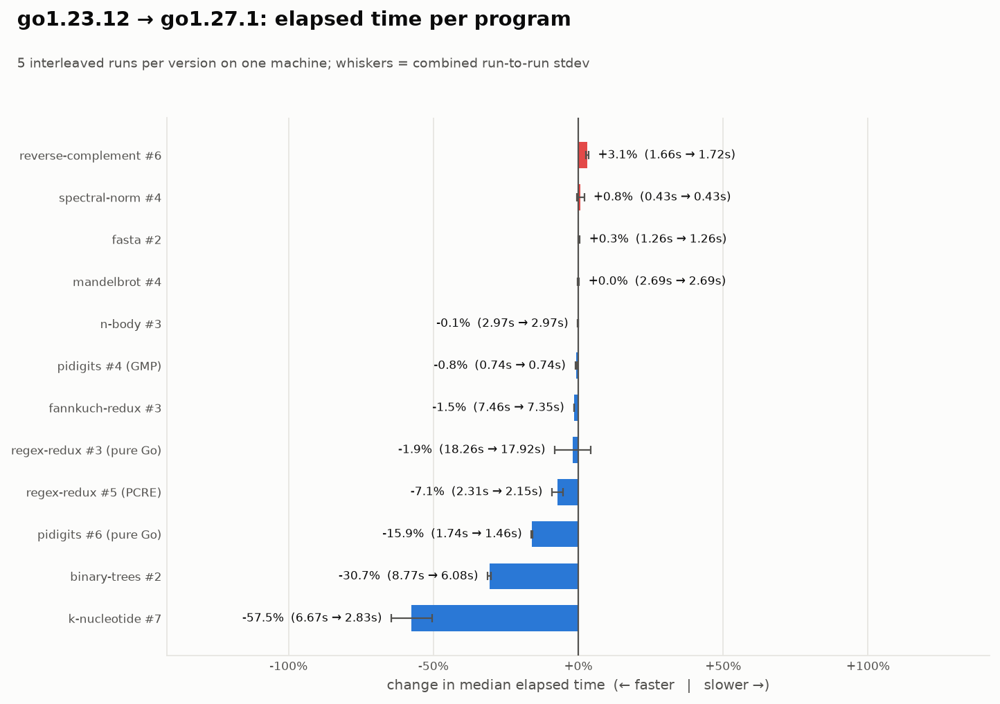
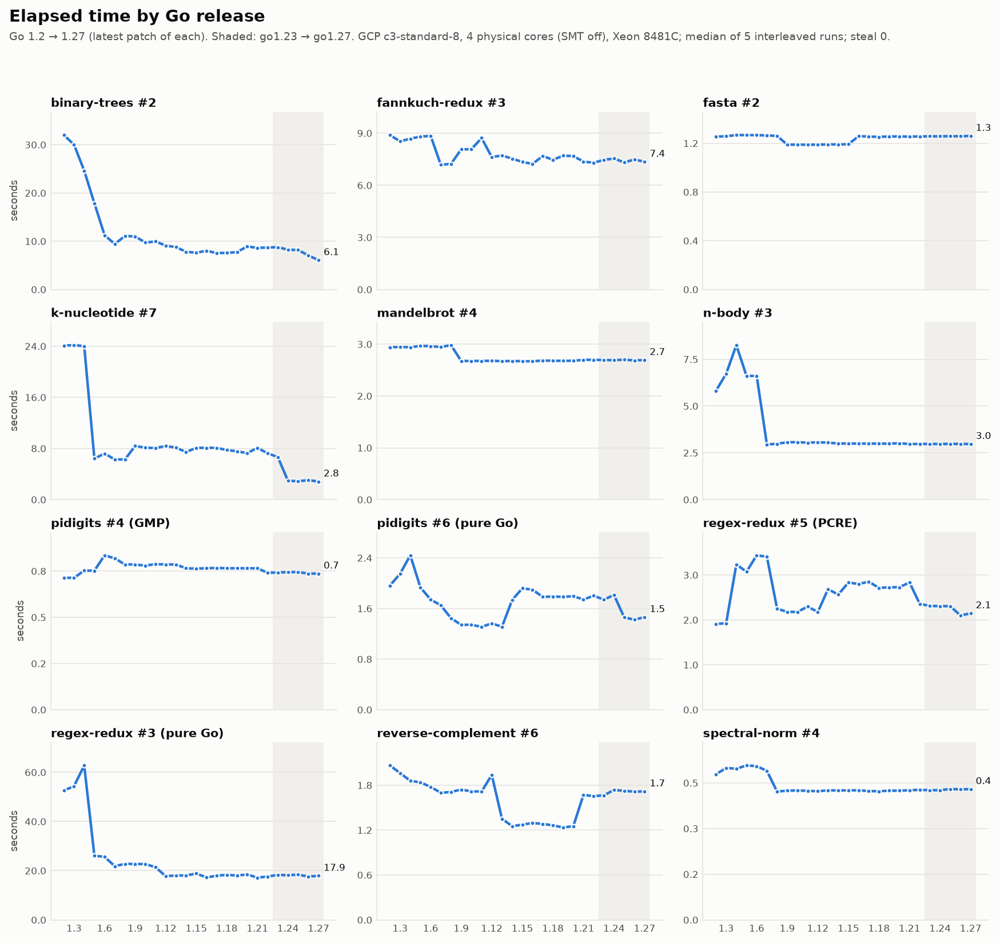
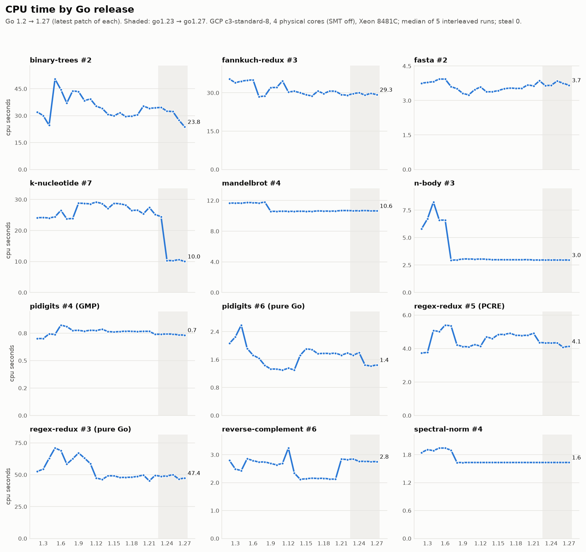
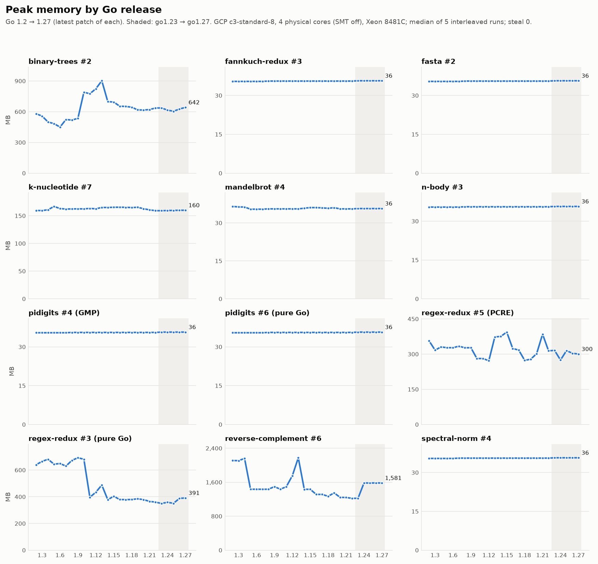
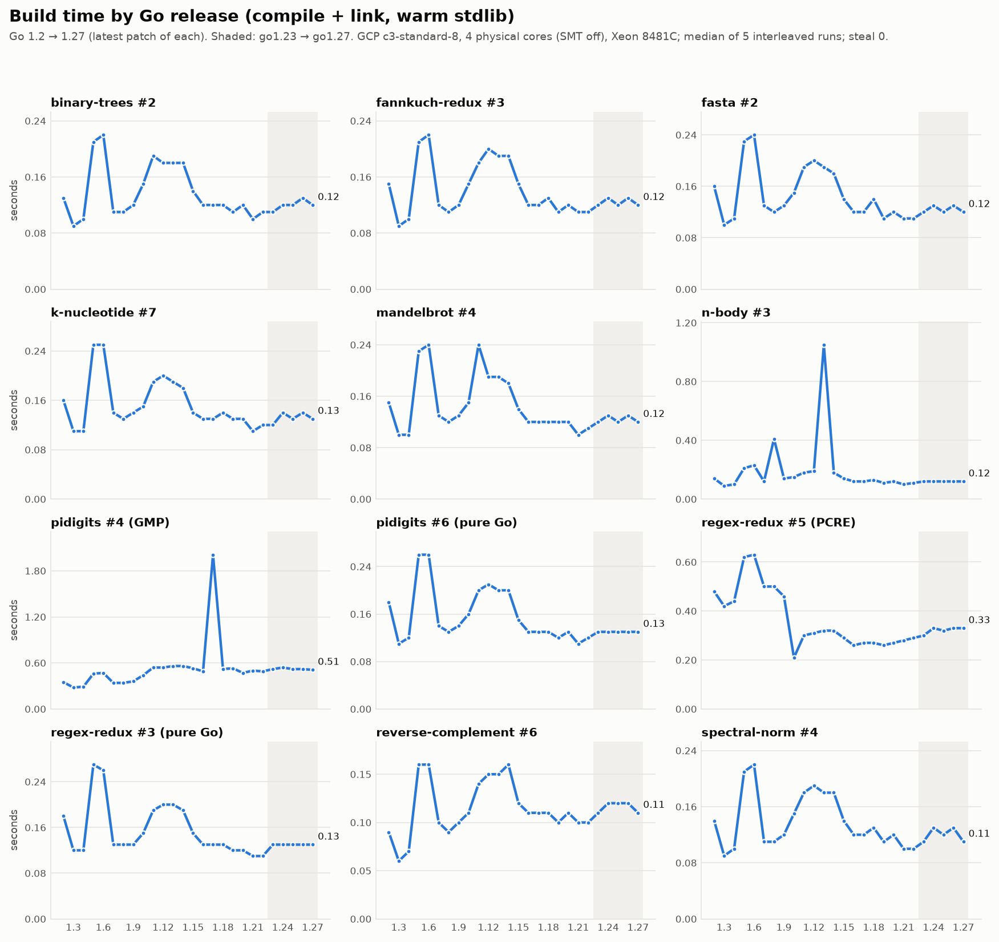

# Results

This report gives the results of the GCP test run on 2026-09-25.
For the procedure and the limits of the results, refer to the [README](../../README.md).

## Test conditions

| item | value |
|---|---|
| machine | GCP `c3-standard-8 --threads-per-core=1` |
| CPU | 4 physical cores, Intel Xeon Platinum 8481C at 2.70 GHz |
| memory | 32 GB RAM |
| Go releases | 26 (latest patch of each minor release, go1.2.2 to go1.27.1) |
| programs | 12 |
| runs | 5 for each program on each release, in alternate sequence |
| settings | `--drop-caches`, `GOAMD64=v2` |

## Summary

- Go 1.27.1 is 11.5% faster than go1.23.12. This value is the geometric mean of the elapsed time.
- Go 1.27.1 uses 12.3% less CPU time than go1.23.12.
- k-nucleotide is 57.5% faster. binary-trees is 30.7% faster. pidigits (pure Go) is 15.9% faster.
- The numeric programs changed by less than 1%. These programs are n-body, mandelbrot, spectral-norm and fasta.
- reverse-complement is 3.1% slower. Its peak memory increased by 29%.

## go1.23 compared with go1.27

### Elapsed time on go1.23 to go1.27

The table shows the median elapsed time in seconds. A lower value is better.
Each value is the median of 5 runs. The "±" value is the standard deviation of the 5 runs.
The last column shows the change from go1.23.12 to go1.27.1. A negative value means that the program is faster.

| program | go1.23.12 | go1.24.13 | go1.25.14 | go1.26.8 | go1.27.1 | 1.23→1.27 |
|---|---:|---:|---:|---:|---:|---:|
| binary-trees #2 | 8.765 ±0.03 | 8.249 ±0.03 | 8.175 ±0.02 | 7.050 ±0.07 | 6.078 ±0.03 | **-30.7%** |
| fannkuch-redux #3 | 7.461 ±0.01 | 7.540 ±0.00 | 7.313 ±0.00 | 7.483 ±0.00 | 7.351 ±0.00 | **-1.5%** |
| fasta #2 | 1.257 ±0.00 | 1.257 ±0.00 | 1.258 ±0.00 | 1.257 ±0.00 | 1.260 ±0.00 | **+0.3%** |
| k-nucleotide #7 | 6.666 ±0.45 | 2.956 ±0.18 | 2.871 ±0.09 | 3.044 ±0.18 | 2.833 ±0.04 | **-57.5%** |
| mandelbrot #4 | 2.693 ±0.01 | 2.691 ±0.00 | 2.700 ±0.02 | 2.687 ±0.00 | 2.693 ±0.00 | **+0.0%** |
| n-body #3 | 2.973 ±0.00 | 2.972 ±0.01 | 2.977 ±0.01 | 2.975 ±0.00 | 2.971 ±0.00 | **-0.1%** |
| pidigits #4 (GMP) | 0.743 ±0.00 | 0.745 ±0.00 | 0.745 ±0.00 | 0.737 ±0.00 | 0.737 ±0.00 | **-0.8%** |
| pidigits #6 (pure Go) | 1.740 ±0.00 | 1.814 ±0.00 | 1.460 ±0.01 | 1.424 ±0.00 | 1.463 ±0.00 | **-15.9%** |
| regex-redux #5 (PCRE) | 2.312 ±0.02 | 2.307 ±0.01 | 2.306 ±0.02 | 2.099 ±0.06 | 2.147 ±0.04 | **-7.1%** |
| regex-redux #3 (pure Go) | 18.265 ±1.05 | 18.175 ±0.98 | 18.379 ±0.86 | 17.628 ±0.67 | 17.922 ±0.41 | **-1.9%** |
| reverse-complement #6 | 1.665 ±0.01 | 1.737 ±0.01 | 1.724 ±0.01 | 1.714 ±0.01 | 1.717 ±0.01 | **+3.1%** |
| spectral-norm #4 | 0.426 ±0.00 | 0.426 ±0.00 | 0.430 ±0.00 | 0.429 ±0.00 | 0.430 ±0.00 | **+0.8%** |
| **geometric mean, relative to 1.23** | 1.000 | 0.937 | 0.916 | 0.897 | 0.885 | **-11.5%** |

### CPU time and peak memory, go1.23.12 compared with go1.27.1

CPU time is user time plus system time on all threads, in seconds.
Peak memory is the maximum resident set size, in MB.

| program | CPU 1.23 (s) | CPU 1.27 (s) | change in CPU | memory 1.23 (MB) | memory 1.27 (MB) | change in memory |
|---|---:|---:|---:|---:|---:|---:|
| binary-trees #2 | 34.60 | 23.77 | -31.3% | 636 | 642 | +0.9% |
| fannkuch-redux #3 | 29.72 | 29.29 | -1.5% | 36 | 36 | +0.0% |
| fasta #2 | 3.65 | 3.67 | +0.5% | 36 | 36 | +0.0% |
| k-nucleotide #7 | 24.44 | 10.01 | -59.0% | 159 | 160 | +0.5% |
| mandelbrot #4 | 10.66 | 10.65 | -0.1% | 36 | 36 | +0.0% |
| n-body #3 | 2.96 | 2.96 | -0.2% | 36 | 36 | +0.0% |
| pidigits #4 (GMP) | 0.74 | 0.73 | -1.1% | 36 | 36 | +0.0% |
| pidigits #6 (pure Go) | 1.73 | 1.45 | -16.1% | 36 | 36 | +0.0% |
| regex-redux #5 (PCRE) | 4.34 | 4.13 | -4.8% | 316 | 300 | -5.0% |
| regex-redux #3 (pure Go) | 48.73 | 47.41 | -2.7% | 350 | 391 | +11.8% |
| reverse-complement #6 | 2.85 | 2.75 | -3.4% | 1,222 | 1,581 | +29.4% |
| spectral-norm #4 | 1.63 | 1.63 | +0.0% | 36 | 36 | +0.0% |

## All releases, go1.2.2 to go1.27.1

Each chart shows one program in each panel. Each point is the median of 5 runs on one release.

