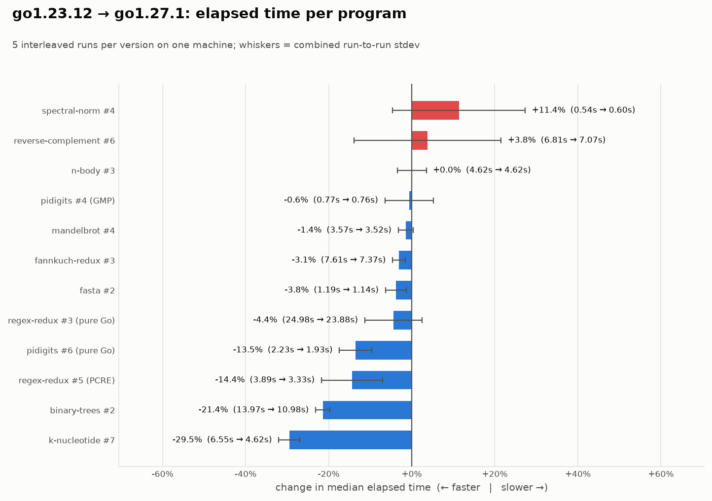
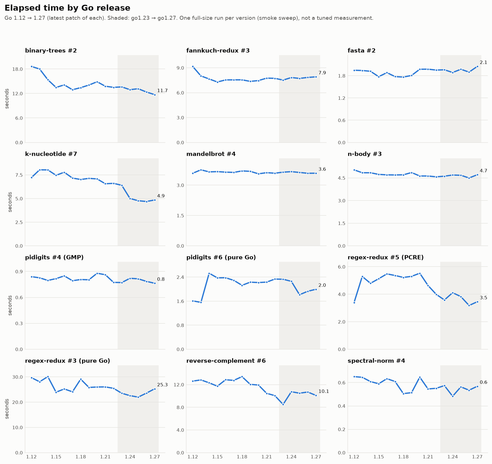
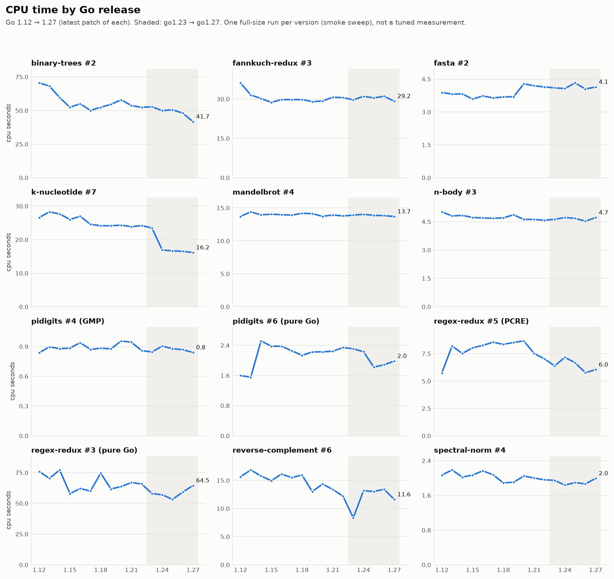
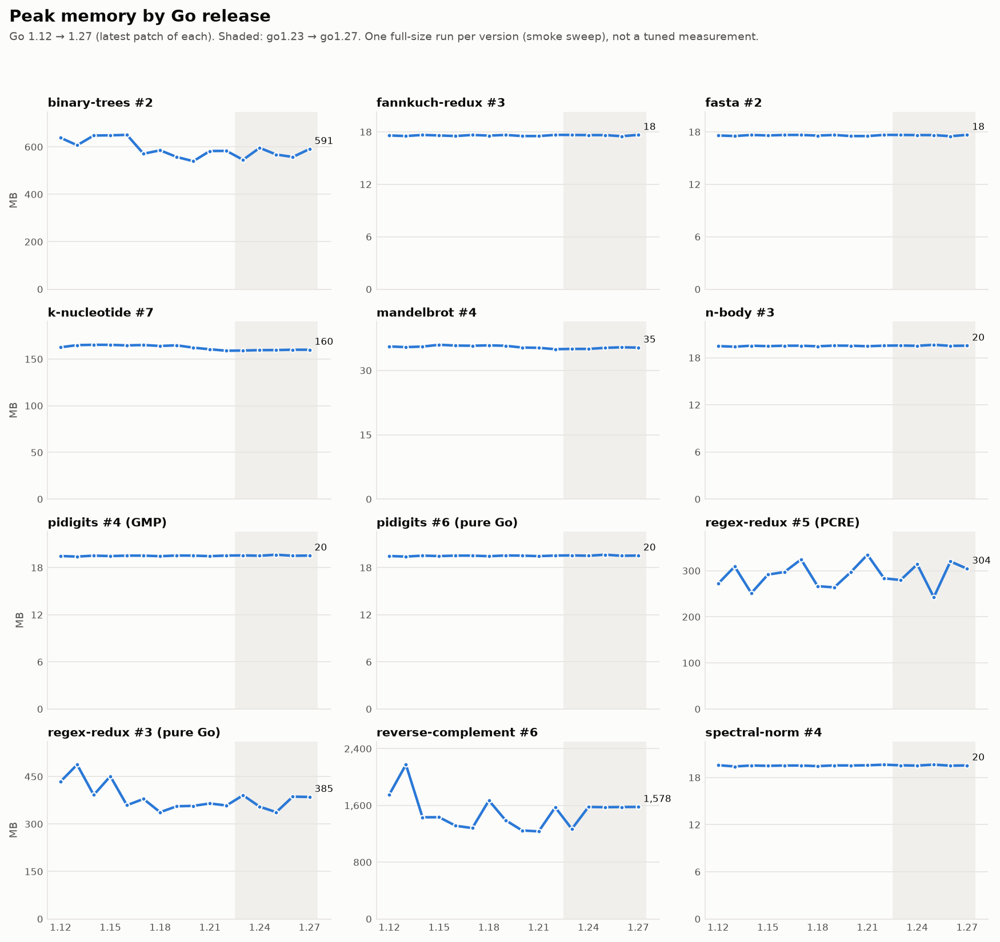
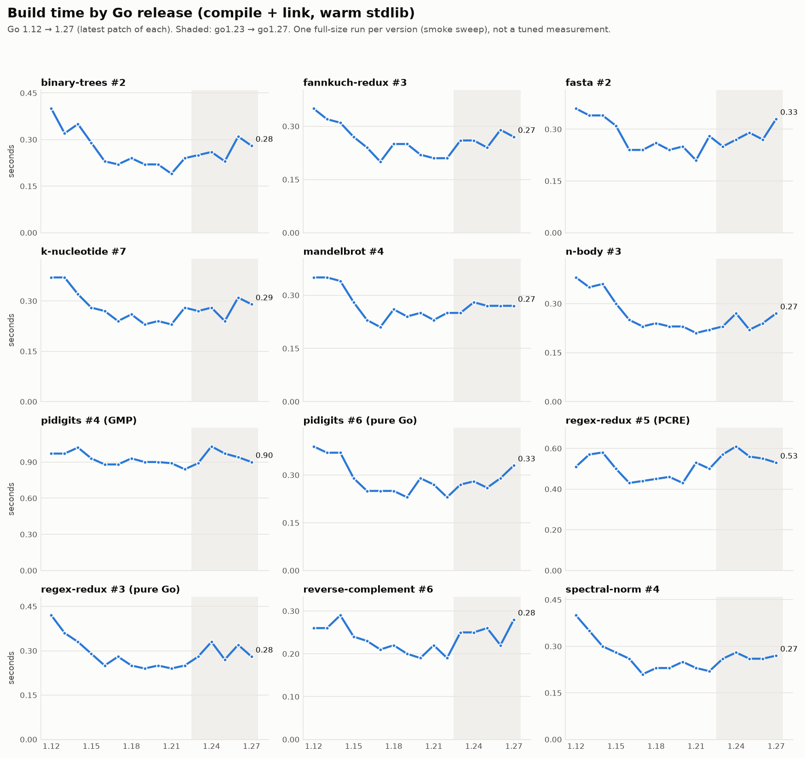

# Results

## 1.23 vs 1.27 (same machine, interleaved)

### Median elapsed seconds, 5 interleaved runs (Intel(R) Xeon(R) Processor @ 2.80GHz ×4)

| program | go1.23.12 | go1.24.13 | go1.25.14 | go1.26.8 | go1.27.1 | 1.23→1.27 |
|---|---:|---:|---:|---:|---:|---:|
| binary-trees #2 | 13.971 ±0.12 | 12.977 ±0.26 | 13.138 ±0.14 | 12.374 ±0.21 | 10.978 ±0.16 | **-21.4%** |
| fannkuch-redux #3 | 7.612 ±0.06 | 7.948 ±0.04 | 7.739 ±0.08 | 7.873 ±0.07 | 7.375 ±0.09 | **-3.1%** |
| fasta #2 | 1.186 ±0.03 | 1.149 ±0.04 | 1.220 ±0.03 | 1.202 ±0.05 | 1.141 ±0.01 | **-3.8%** |
| k-nucleotide #7 | 6.547 ±0.06 | 4.768 ±0.25 | 4.822 ±0.11 | 4.786 ±0.06 | 4.617 ±0.11 | **-29.5%** |
| mandelbrot #4 | 3.573 ±0.06 | 3.599 ±0.05 | 3.550 ±0.03 | 3.528 ±0.06 | 3.522 ±0.03 | **-1.4%** |
| n-body #3 | 4.616 ±0.15 | 4.626 ±0.07 | 4.705 ±0.08 | 4.723 ±0.12 | 4.618 ±0.07 | **+0.0%** |
| pidigits #4 (GMP) | 0.766 ±0.02 | 0.792 ±0.03 | 0.778 ±0.02 | 0.764 ±0.04 | 0.762 ±0.04 | **-0.6%** |
| pidigits #6 (pure Go) | 2.234 ±0.07 | 2.286 ±0.07 | 1.881 ±0.04 | 1.787 ±0.09 | 1.932 ±0.05 | **-13.5%** |
| regex-redux #5 (PCRE) | 3.894 ±0.24 | 4.104 ±0.11 | 3.787 ±0.07 | 3.380 ±0.15 | 3.335 ±0.13 | **-14.4%** |
| regex-redux #3 (pure Go) | 24.982 ±1.61 | 23.582 ±0.75 | 23.363 ±1.36 | 23.351 ±0.93 | 23.879 ±0.60 | **-4.4%** |
| reverse-complement #6 | 6.808 ±1.19 | 6.653 ±1.30 | 7.715 ±0.36 | 7.213 ±0.61 | 7.070 ±0.19 | **+3.8%** |
| spectral-norm #4 | 0.535 ±0.06 | 0.587 ±0.05 | 0.625 ±0.07 | 0.628 ±0.05 | 0.596 ±0.07 | **+11.4%** |
| **geomean vs 1.23** | 1.000 | 0.979 | 0.977 | 0.952 | 0.929 | **-7.1%** |

### 1.23 → 1.27: cpu seconds and peak memory

| program | cpu 1.23 | cpu 1.27 | Δ cpu | mem MB 1.23 | mem MB 1.27 | Δ mem |
|---|---:|---:|---:|---:|---:|---:|
| binary-trees #2 | 53.96 | 41.98 | -22.2% | 625 | 612 | -2.2% |
| fannkuch-redux #3 | 29.85 | 29.04 | -2.7% | 20 | 20 | +0.0% |
| fasta #2 | 3.91 | 3.78 | -3.4% | 20 | 20 | +0.0% |
| k-nucleotide #7 | 23.68 | 15.83 | -33.1% | 159 | 160 | +0.5% |
| mandelbrot #4 | 13.99 | 13.78 | -1.5% | 35 | 36 | +1.6% |
| n-body #3 | 4.64 | 4.64 | -0.1% | 20 | 20 | +0.0% |
| pidigits #4 (GMP) | 0.84 | 0.84 | -0.2% | 20 | 20 | +0.0% |
| pidigits #6 (pure Go) | 2.23 | 1.91 | -14.3% | 20 | 20 | +0.0% |
| regex-redux #5 (PCRE) | 6.88 | 5.92 | -14.0% | 316 | 320 | +1.2% |
| regex-redux #3 (pure Go) | 64.12 | 58.93 | -8.1% | 364 | 388 | +6.4% |
| reverse-complement #6 | 12.52 | 12.65 | +1.0% | 1,268 | 1,579 | +24.5% |
| spectral-norm #4 | 1.92 | 1.98 | +3.3% | 20 | 20 | +0.0% |

## Across every release (smoke sweep, 1 run each)

